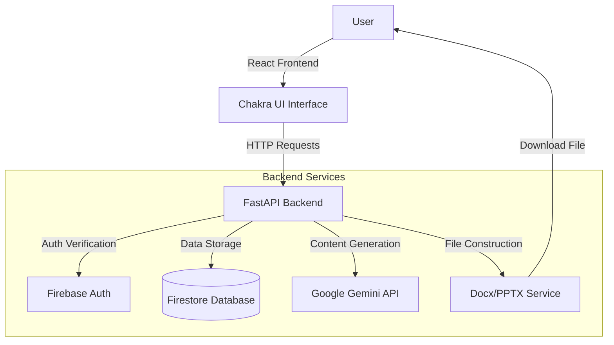

# AI-Assisted Document Authoring Platform


## Overview

A full-stack AI-powered web application that enables users to generate, refine, and export professional business documents (Word and PowerPoint) with iterative AI assistance using Google Gemini.

## Features

- 🔐 **User Authentication:** Secure login and project management via Firebase.
- 🤖 **AI Outline Generation:** Automatically suggests document structures based on topics.
- 📝 **Context-Aware Generation:** Uses Google Gemini to write specific section content.
- ✨ **Iterative Refinement:** Refine content with natural language prompts (e.g., "Make this more formal").
- 📊 **Version Control:** Track changes with rollback capability and feedback (like/dislike).
- 📥 **Export Engine:** Download finished work as formatted `.docx` or `.pptx` files.


## Architecture

The application follows a modern client-server architecture:


## Tech Stack

### Backend

  - **FastAPI:** High-performance Python web framework.
  - **Google Firestore:** NoSQL database for user and project data.
  - **Google Gemini API (gemini-2.5-flash):** LLM for content generation.
  - **python-docx / python-pptx:** Libraries for document assembly.
  - **Firebase Auth:** User authentication.

### Frontend

  - **React + Vite:** Modern frontend framework.
  - **Chakra UI:** Component library.
  - **Axios:** HTTP client.

## Prerequisites

  - Python 3.9 or higher
  - Node.js 16 or higher
  - Google Cloud account with Gemini API access
  - Firebase project with Firestore and Authentication enabled

## Setup Instructions

### 1\. Backend Setup

Navigate to the backend directory:

```bash
cd backend
```

Create and activate virtual environment:

```bash
python -m venv venv
# Windows:
venv\Scripts\activate
# Mac/Linux:
source venv/bin/activate 
```

Install dependencies:

```bash
pip install -r requirements.txt
```

Create a `.env` file in the `backend/` directory:

```bash
GEMINI_API_KEY=your_gemini_api_key_here
FIREBASE_PROJECT_ID=your_firebase_project_id
GOOGLE_APPLICATION_CREDENTIALS=serviceAccountKey.json
```

**Firebase Credentials:**

1.  Download `serviceAccountKey.json` from Firebase Console (Project Settings → Service Accounts).
2.  Place it in the `backend/` directory.

Run the backend server:

```bash
uvicorn app.main:app --reload --host 0.0.0.0 --port 8000
```

> 🚀 **Server Status:** The backend API will be running at **http://localhost:8000** \> 📄 **Docs:** Swagger UI is available at **http://localhost:8000/docs**

### 2\. Frontend Setup

Navigate to the frontend directory:

```bash
cd frontend
```

Install dependencies:

```bash
npm install
```

Create a `.env` file in the `frontend/` directory.  
**Note:** Ensure `VITE_API_BASE_URL` points to port `8000` (your backend).

```bash
VITE_API_BASE_URL=http://localhost:8000
VITE_FIREBASE_API_KEY=your_firebase_api_key
VITE_FIREBASE_AUTH_DOMAIN=your_auth_domain
VITE_FIREBASE_PROJECT_ID=your_project_id
VITE_FIREBASE_STORAGE_BUCKET=your_storage_bucket
VITE_FIREBASE_MESSAGING_SENDER_ID=your_sender_id
VITE_FIREBASE_APP_ID=your_app_id
```

Run the development server:

```bash
npm run dev
```

> 💻 **App Status:** The frontend application will be running at **http://localhost:5173**

## Usage Guide

1.  **Register/Login:** Create an account (projects are private to your user).
2.  **Create Project:** Select "Word" or "PowerPoint" and enter a topic (e.g., "Q4 Marketing Strategy").
3.  **Structure:** Use **AI-Suggest Outline** to auto-generate headers, or add them manually.
4.  **Generate:** Click **"Generate Content with AI"** for specific sections.
5.  **Refine:** Use the chat box to tweak content (e.g., "Shorten this," "Add data").
6.  **Export:** Click **Export** to download the final file.

### Sample Topics

  * **Word:** "Market analysis of the electric vehicle industry in 2025"
  * **PowerPoint:** "Investor Pitch Deck for SaaS Startup"

## Project Structure

```text
ai-document-generator/
├── backend/
│   ├── app/
│   │   ├── core/           # Config & Dependencies
│   │   ├── models/         # Pydantic Schemas
│   │   ├── routers/        # API Endpoints
│   │   ├── services/       # Gemini & Export Logic
│   │   └── utils/          # Firebase Helpers
│   └── requirements.txt
├── frontend/
│   ├── src/
│   │   ├── components/     # UI Components
│   │   ├── pages/          # App Routes
│   │   └── services/       # API Integration
│   └── package.json
└── README.md
```

## Demo Video

📹 **[Watch Demo Video](https://www.google.com/search?q=PLACEHOLDER_LINK)**

## Challenges & Learnings

### Challenges Faced

1.  **LLM Response Consistency:** The Gemini API sometimes included conversational filler ("Here is your text..."). I implemented regex cleaning to ensure only clean content enters the document.
2.  **Document Export:** Mapping React state to strict XML-based formats (`.docx`/`.pptx`) required careful handling of styling and bullet points.
3.  **State Management:** Managing a three-stage workflow (Config → Generate → Refine) with history tracking required complex React state lifting.

### Key Learnings

  - **Prompt Engineering:** Learned to use "System Instructions" effectively to force the LLM into a JSON-only or Pure-Content mode.
  - **FastAPI Streaming:** Gained experience handling longer AI generation times without timing out the frontend.
  - **NoSQL Design:** Structured Firestore data hierarchically (Project -\> Section -\> Version) to allow efficient history rollbacks.

## Future Enhancements

  - [ ] Real-time collaboration (WebSockets).
  - [ ] Custom templates (Resume, Invoice, Brochure).
  - [ ] PDF Export support.
  - [ ] Integration with Google Drive API.
